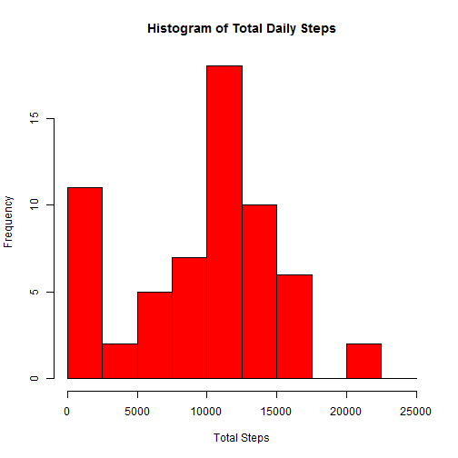
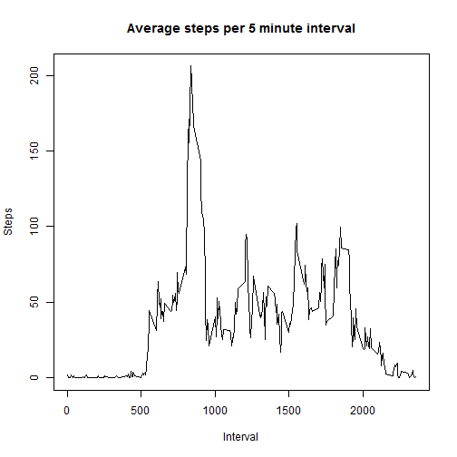
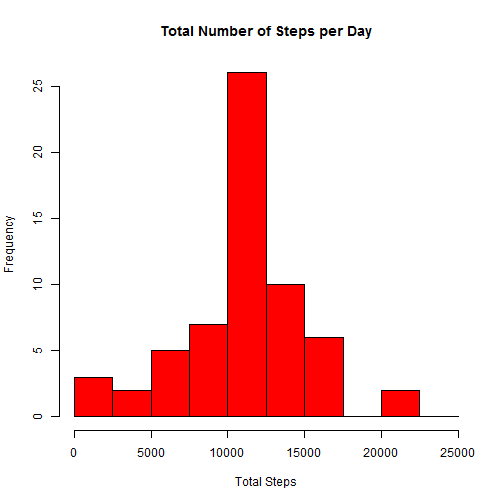

This assignment makes use of data from a personal activity monitoring device.
This device collects data at 5 minute intervals through out the day. The data
consists of two months of data from an anonymous individual collected during
the months of October and November, 2012 and include the number of steps
taken in 5 minute intervals each day.

Many questions will be asked of this data with the answers presented below.

Load and inspect the Activity dataset:

```r
setwd("C:/Users/kwkaufma/Documents/Training/Coursera/Reproducible Research/Lab1")
act <- read.csv("activity.csv")
act$date <- as.Date(as.character(act$date), "%m/%d/%Y")
summary(act)
```

```
##      steps             date               interval     
##  Min.   :  0.00   Min.   :2012-10-01   Min.   :   0.0  
##  1st Qu.:  0.00   1st Qu.:2012-10-16   1st Qu.: 588.8  
##  Median :  0.00   Median :2012-10-31   Median :1177.5  
##  Mean   : 37.38   Mean   :2012-10-31   Mean   :1177.5  
##  3rd Qu.: 12.00   3rd Qu.:2012-11-15   3rd Qu.:1766.2  
##  Max.   :806.00   Max.   :2012-11-30   Max.   :2355.0  
##  NA's   :2304
```

Aggregate the steps by day:

```r
agg_Steps <- aggregate(act$steps, by=list(act$date), FUN=sum, na.rm=TRUE)
colnames(agg_Steps) <- c("Day", "Steps")
summary(agg_Steps)
```

```
##       Day                 Steps      
##  Min.   :2012-10-01   Min.   :    0  
##  1st Qu.:2012-10-16   1st Qu.: 6778  
##  Median :2012-10-31   Median :10395  
##  Mean   :2012-10-31   Mean   : 9354  
##  3rd Qu.:2012-11-15   3rd Qu.:12811  
##  Max.   :2012-11-30   Max.   :21194
```

Histogram of Total Steps per Day:

```r
hist(agg_Steps$Steps, breaks=seq(from=0, to=25000, by=2500), col="red", xlab="Total Steps", main="Histogram of Total Daily Steps")
```

 

Calculate the Mean of the Total Steps per Day

```r
mean(agg_Steps$Steps)
```

```
## [1] 9354.23
```

Calculate the Median of the Total Steps per Day

```r
median(agg_Steps$Steps)
```

```
## [1] 10395
```

Aggregate data - Mean by Interval - and plot the data

```r
mean_Int <- aggregate(act$steps, by=list(act$interval), FUN=mean, na.rm=TRUE)
colnames(mean_Int) <- c("Interval", "Steps")
plot(mean_Int$Interval, mean_Int$Steps, type = "l", ylab = "Steps", xlab = "Interval", main = "Average steps per 5 minute interval")
```

 

Interval with the max number of steps on average

```r
mean_Int[which.max(mean_Int$Steps), 1]
```

```
## [1] 835
```

Number of steps with missing values

```r
sum(is.na(act$steps))
```

```
## [1] 2304
```

Replace NA values with Mean number of steps in a day

```r
act2 <- act
mean_Steps_NoNA <- mean(act$steps, na.rm=TRUE)
act2[is.na(act2)] <- mean_Steps_NoNA
sum(is.na(act2$steps))
```

```
## [1] 0
```


Aggregate the steps by day from the dataset without NA values

```r
agg_Steps_NoNA <- aggregate(act2$steps, by=list(act2$date), FUN=sum)
colnames(agg_Steps_NoNA) <- c("Day", "Steps")
summary(agg_Steps_NoNA)
```

```
##       Day                 Steps      
##  Min.   :2012-10-01   Min.   :   41  
##  1st Qu.:2012-10-16   1st Qu.: 9819  
##  Median :2012-10-31   Median :10766  
##  Mean   :2012-10-31   Mean   :10766  
##  3rd Qu.:2012-11-15   3rd Qu.:12811  
##  Max.   :2012-11-30   Max.   :21194
```

create plot total steps per day from the dataset without NA values

```r
hist(agg_Steps_NoNA$Steps, breaks=seq(from=0, to=25000, by=2500), col="red", xlab="Total Steps", main="Total Number of Steps per Day")
```

 

Mean of the Total Steps per Day from the dataset without NA values

```r
mean(agg_Steps_NoNA$Steps)
```

```
## [1] 10766.19
```

Median of the Total Steps per Day from the dataset without NA values

```r
median(agg_Steps_NoNA$Steps)
```

```
## [1] 10766.19
```

Add columns for weekday, and classification of weekday/weekend

```r
act2 <- cbind(act2, weekday = weekdays(act2$date))
act2 <- cbind(act2,daycat=ifelse((act2$weekday == "Saturday" | act2$weekday == "Sunday"), "weekend", "weekday"))
str(act2)
```

```
## 'data.frame':	17568 obs. of  5 variables:
##  $ steps   : num  37.4 37.4 37.4 37.4 37.4 ...
##  $ date    : Date, format: "2012-10-01" "2012-10-01" ...
##  $ interval: int  0 5 10 15 20 25 30 35 40 45 ...
##  $ weekday : Factor w/ 7 levels "Friday","Monday",..: 2 2 2 2 2 2 2 2 2 2 ...
##  $ daycat  : Factor w/ 2 levels "weekday","weekend": 1 1 1 1 1 1 1 1 1 1 ...
```

Aggregate data - Mean by Interval, daycat

```r
mean_Int_Daycat <- aggregate(act2$steps, by=list(act2$interval, act2$daycat), FUN=mean)
colnames(mean_Int_Daycat) <- c("Interval", "Daycat", "Steps")
summary(mean_Int_Daycat)
```

```
##     Interval          Daycat        Steps        
##  Min.   :   0.0   weekday:288   Min.   :  4.673  
##  1st Qu.: 588.8   weekend:288   1st Qu.:  6.378  
##  Median :1177.5                 Median : 27.773  
##  Mean   :1177.5                 Mean   : 38.988  
##  3rd Qu.:1766.2                 3rd Qu.: 59.204  
##  Max.   :2355.0                 Max.   :207.873
```

create time series plot mean interval grouped by weekday vs weekend

```r
library(lattice)
xyplot(Steps ~ Interval | Daycat, mean_Int_Daycat, type="l", xlab="Interval", ylab="Number of steps", layout=c(1,2))
```

 
